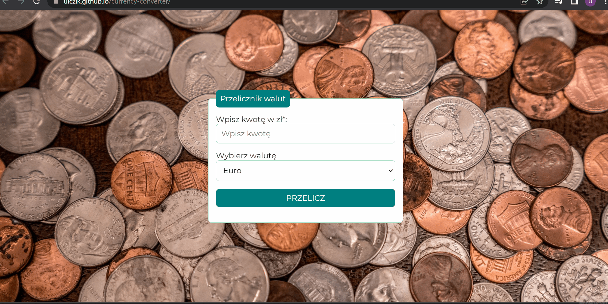

# *Currency converter*
This repository presents simple **currency converter**.

## Demo
https://ulczik.github.io/currency-converter/

## Description
This currency converter exchange Polish zloty into:
1. Euro
2. US dollar
3. British pound
4. Japanese yen

Below is instruction how to use this application.

## Languages
- HTML
- CSS, Flex-box
- BEM
- JavaScript	

